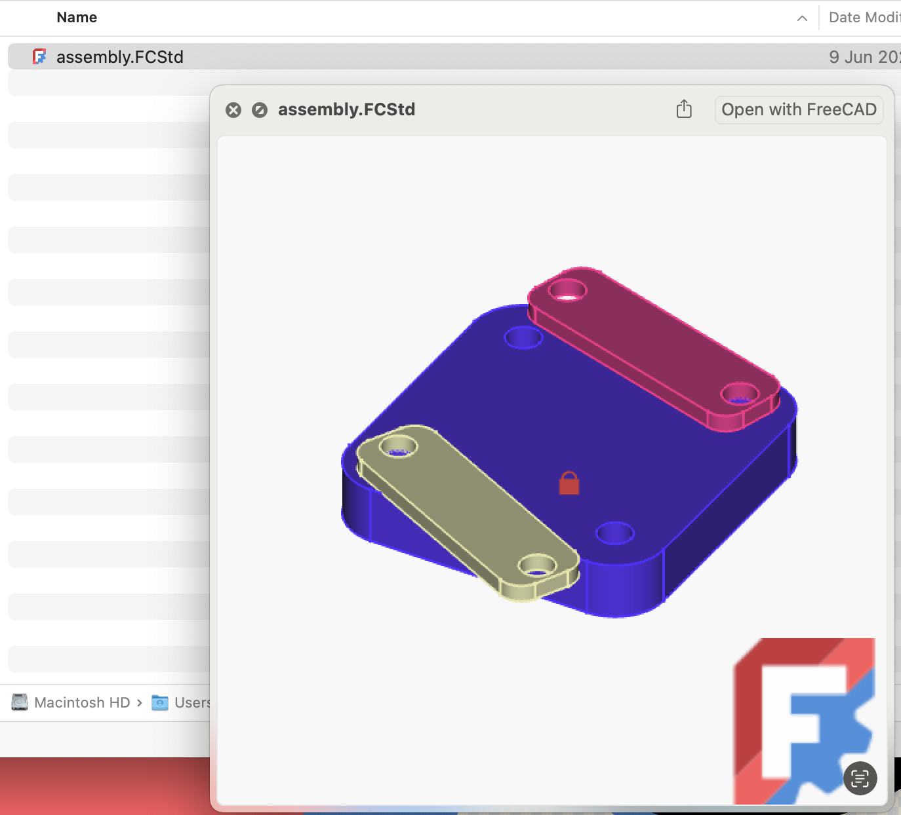

# FreeCAD Thumbnail Preview for macOS

## Overview

This project provides a modern QuickLook extension for macOS to preview FreeCAD (`.FCStd`) files directly in Finder. It replaces the legacy FreeCAD `qlgenerator` plugin, which is no longer supported on recent macOS versions.

---

## How It Looks

When browsing your FreeCAD projects in Finder, you will see a live preview of the model's thumbnail, just like this:



---

## Confirming Extension Installation

After building and installing the app, confirm that the QuickLook extension is enabled:

1. Open **System Settings** > **Privacy & Security** > **Extensions** > **Quick Look**.
2. Ensure **FreeCAD Thumbnail Preview** is checked.
3. You can also use the following command in Terminal to force QuickLook to reload its plugins:

   ```sh
   qlmanage -r
   ```


---

## Why?

Apple has modernized QuickLook plugins, and the old FreeCAD `qlgenerator` is not compatible with current macOS versions. This project provides a native, secure, and future-proof solution for previewing FreeCAD files.

---

## How Does It Work?

When you select a `.FCStd` file in Finder, this extension:

- Opens the file (which is a ZIP archive).
- Extracts and displays the embedded `Thumbnail.png` image.
- Shows the thumbnail as the file preview in Finder and QuickLook.

**Note:**
- For best results, configure FreeCAD to save a 256x256 or ideally a 512x512 thumbnail when saving your projects.
- In FreeCAD, go to **Edit > Preferences > General > Document** and set the thumbnail size.


---

## Build from Source

You can build and install the extension yourself—no subscription or payment required!

### Steps

1. Open the project in Xcode.
2. Select the `FreeCAD Thumbnail Preview` target.
3. Build and run (⌘R) to test locally.
4. To install system-wide:
    - Archive the app (**Product > Archive** in Xcode).
    - Export and move the app to `/Applications`.
5. Open the app once to register the extension.
6. Confirm the extension is enabled (see above).
7. If previews do not appear, run:

   ```sh
   qlmanage -r
   ```

---

## Troubleshooting

- If the preview does not show up, ensure the extension is enabled in System Settings.
- Try running `qlmanage -r` to refresh QuickLook.
- Make sure your `.FCStd` files contain a `Thumbnail.png` (see FreeCAD settings above).

---

## Project Goals

This project aims to be integrated into FreeCAD itself, providing a seamless preview experience for all macOS users.

---

## License

MIT License. See [LICENSE](LICENSE) for details.
