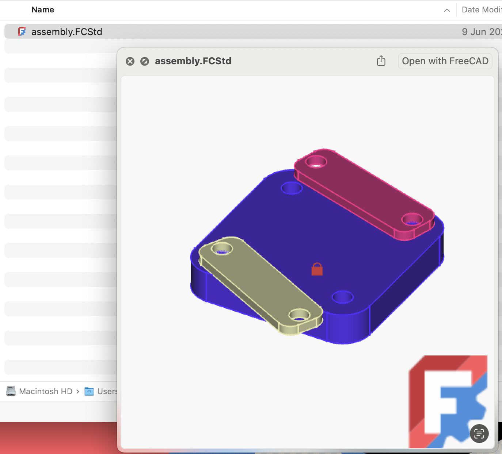
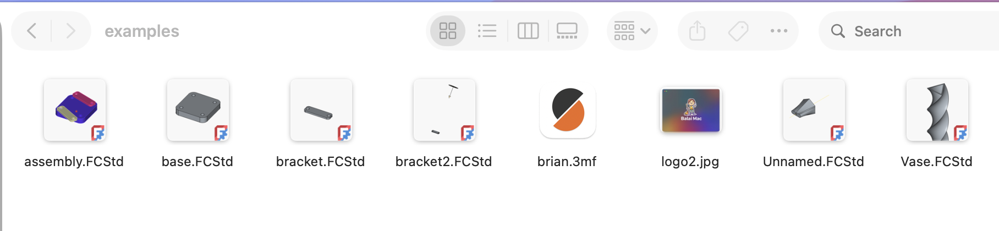
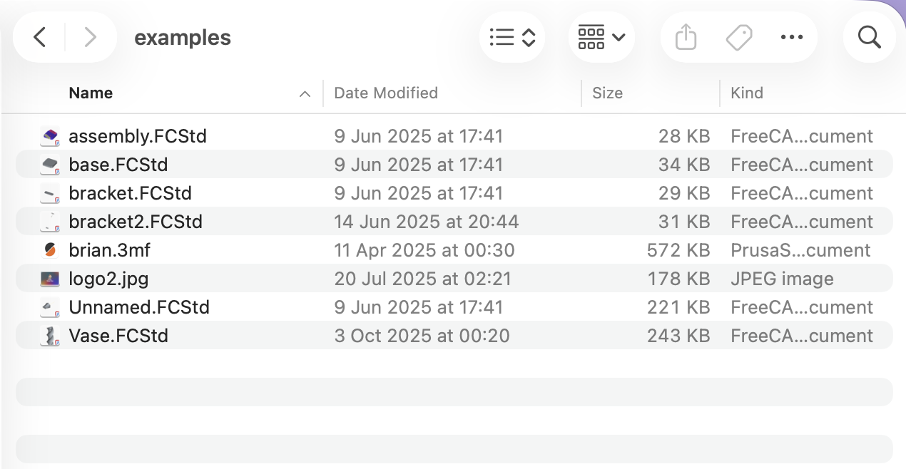

# FreeCAD Companion for macOS

Modern Quick Look extensions to preview FreeCAD `*.FCStd` files in Finder.
This replaces the legacy `qlgenerator` and uses current macOS APIs to show the
PNG thumbnail embedded in FreeCAD documents.

- Quick Look preview (press Space) shows the embedded `Thumbnail.png`.
- Finder thumbnails use the same embedded image.

---

## Preview examples

Quick Look preview:



Finder thumbnails:




---

## Build & install

1. Open the project in Xcode.
2. Select the `FreeCAD Companion` target and build/run (⌘R) to test.
3. To install for all users:
   - Archive (Product > Archive), export the app, and move it to `/Applications`.
4. Launch the app once to register the extension.
5. If thumbnails or previews do not appear, refresh Quick Look:

```FreeCADThumbnailPreview/README.md#L1-1
qlmanage -r
killall Finder
```

---

## Enable the extension

Open System Settings > Privacy & Security > Extensions > Quick Look and enable
`FreeCAD Companion`.


---

## How it works

- A `.FCStd` file is a ZIP archive. The extension opens the archive,
  extracts `Thumbnail.png`, and renders that image for previews and thumbnails.
- No model parsing — only the embedded PNG is used.

For best results, configure FreeCAD to save a larger thumbnail (256×256 or 512×512):
Edit > Preferences > General > Document → Thumbnail size.


---

## Troubleshooting

- Ensure `FreeCAD Companion` is enabled in System Settings.
- Run `qlmanage -r` to reload Quick Look plugins.
- Verify your `.FCStd` files contain `Thumbnail.png` (check FreeCAD thumbnail settings).

---

## Goal & License

This project aims to provide a native, future-proof preview experience and is
intended for integration into FreeCAD. Licensed under MIT — see `LICENSE`.
